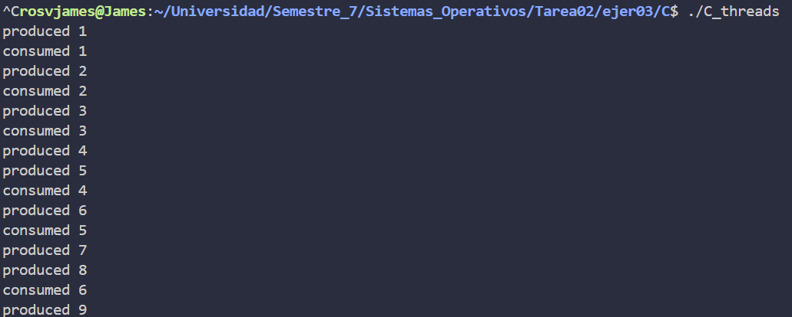
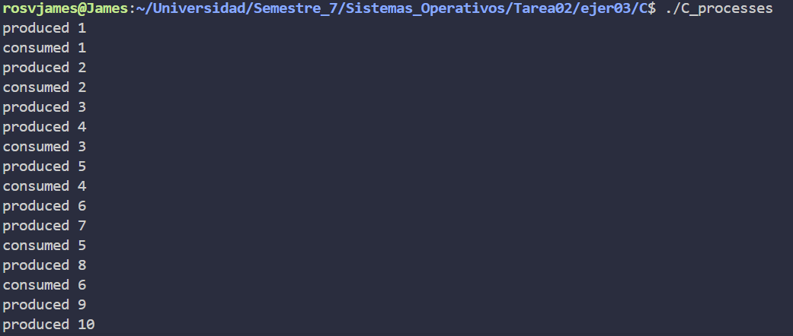
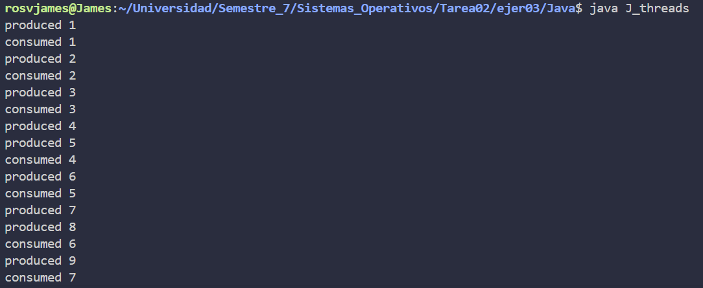
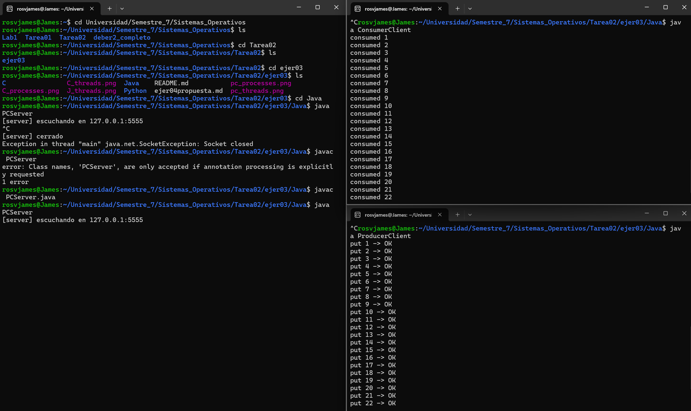
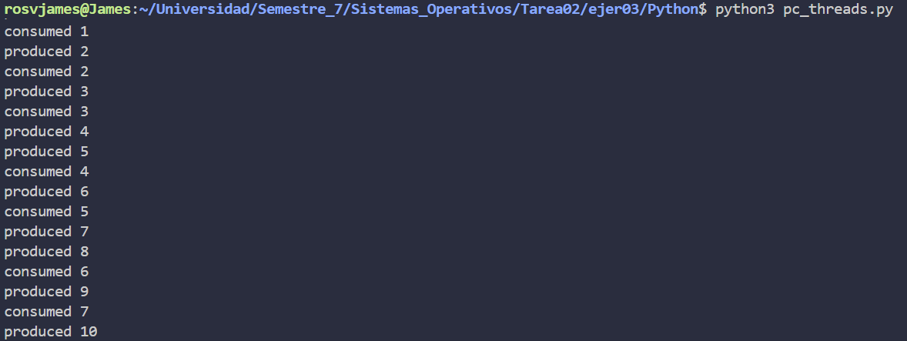
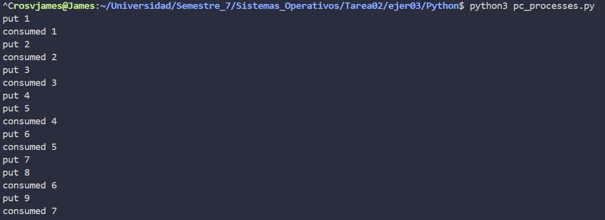

## Ejercicio 3 — Productor–Consumidor (implementación, comparación y aporte)

### 1) Qué se implementó
Se resolvió el problema clásico **Productor–Consumidor con buffer acotado N** usando el patrón `empty / full / mutex`:

- **C/**
  - **hilos**: `pc_threads.c` con `pthread` + `sem_init/sem_wait/sem_post` y buffer circular.
  - **procesos**: `pc_proc_clean.c` con **memoria compartida POSIX** (`shm_open` + `mmap`) y **semáforos con nombre** (`sem_open`). Incluye **limpieza** en `SIGINT` para permitir *reruns* sin objetos POSIX “colgados”.
- **Java/**
  - **hilos**: `PCThreads.java` con `Semaphore` + buffer circular.
  - **procesos (cliente/servidor por sockets)**:
    - `PCServer.java`: mantiene el recurso (buffer) con `ArrayBlockingQueue`.
    - `ProducerClient.java` y `ConsumerClient.java`: envían `"PUT X"` / `"TAKE"` al servidor.
    - Usa `setReuseAddress(true)` y *shutdown hook* para **rerun limpio**.
- **Python/**
  - **hilos**: `pc_threads.py` con `threading.Semaphore` y `Lock` + buffer circular.
  - **procesos**: `pc_processes.py` con `multiprocessing.Queue(maxsize=N)` (bloquea al estar lleno/vacío; no requiere semáforos manuales).

> Nota: En todas las versiones de “hilos” el **buffer circular** usa índices `in/out` avanzando módulo `N`, y **no** hay sobrescritura: `empty/full` bloquean cuando corresponde.

---

### 2) Comparación (literal c)

**Correctitud y modelo de memoria**
- **Hilos (C/Java/Python):** memoria compartida **implícita** → se requiere `mutex` para sección crítica y `empty/full` para capacidad/elementos.
- **Procesos:**
  - **C:** memoria compartida **explícita** (POSIX) + semáforos **con nombre** compartidos por kernel.
  - **Java:** no hay semáforos inter-proceso estándar; la opción **simple y portable** es **sockets** con un servidor que centraliza el buffer.
  - **Python:** `multiprocessing.Queue` ya implementa bloqueo y canal IPC.

**Simplicidad de implementación (de más simple a más compleja en esta tarea)**
- **Python procesos** (cola lista) ≈ **Java procesos** (sockets) ≈ **Java hilos**
- **C hilos**
- **C procesos** (por manejo de `shm_*`, `sem_open` y limpieza)

**Overhead / rendimiento (cualitativo)**
- **Hilos:** más ligeros; comparten memoria y el *context switch* suele ser más barato.
- **Procesos:** coste de IPC:
  - **C (SHM):** eficiente pero requiere más código/limpieza.
  - **Java (sockets loopback):** pila de red local, suficiente para la demo.
  - **Python (`multiprocessing.Queue`):** pipes/locks internos con rendimiento aceptable y código mínimo.

**Robustez / rerun**
- **C procesos:** `sem_close/sem_unlink`, `munmap`, `shm_unlink` y handler de señal → **sin residuos** en `/dev/shm`.
- **Java procesos:** `SO_REUSEADDR` + *shutdown hook* → rebind inmediato del puerto.
- **Hilos (C/Java/Python):** sin recursos persistentes → rerun trivial.

**Facilidad de depuración**
- **Java/Python:** excepciones legibles, menos API de bajo nivel.
- **C procesos:** revisar nombres POSIX, permisos y limpieza (propenso a typos en `sem_unlink/shm_unlink` si no se usan constantes).

---

### 3) Resultados de las implementaciones

A continuación se presentan capturas de pantalla de la ejecución de cada implementación del problema Productor-Consumidor, demostrando que todas funcionan correctamente:

#### C - Hilos (pthread)


**Descripción:** La captura muestra la ejecución del programa con hilos en C. Se observa claramente:
- La **sincronización correcta** entre productores y consumidores usando semáforos `empty`, `full` y `mutex`
- Los **productores** generan items y los agregan al buffer circular (mensaje "Productor X produce item Y")
- Los **consumidores** extraen items del buffer y los procesan (mensaje "Consumidor X consume item Y")
- **No hay condiciones de carrera**: cada operación de producción/consumo es atómica gracias al mutex
- El buffer respeta su **capacidad máxima**: `empty` bloquea a productores cuando está lleno, `full` bloquea a consumidores cuando está vacío

#### C - Procesos (memoria compartida POSIX)


**Descripción:** Esta implementación usa procesos separados con IPC POSIX. Se aprecia:
- **Memoria compartida** (`shm_open` + `mmap`) para el buffer que es accesible por todos los procesos
- **Semáforos con nombre** (`sem_open`) para sincronización inter-proceso
- La **limpieza correcta** de recursos POSIX al finalizar (handler de SIGINT)
- El comportamiento es idéntico a la versión con hilos, pero con procesos independientes
- **Múltiples procesos coordinados** sin corrupción de datos ni deadlocks

#### Java - Hilos (Semaphore)


**Descripción:** Implementación Java con hilos nativos. Se visualiza:
- Uso de `java.util.concurrent.Semaphore` para implementar el patrón `empty/full/mutex`
- **Buffer circular** con índices que avanzan módulo N
- **Alternancia controlada** entre productores y consumidores
- La **salida ordenada** muestra que no hay race conditions
- Los hilos Java se sincronizan correctamente, bloqueando cuando el buffer está lleno o vacío

#### Java - Procesos (Cliente/Servidor por sockets)


**Descripción:** Arquitectura cliente-servidor con tres procesos Java separados. Se muestra:
- **PCServer**: mantiene el buffer compartido usando `ArrayBlockingQueue` (que encapsula `empty/full/mutex`)
- **ProducerClient**: envía comandos `PUT X` al servidor
- **ConsumerClient**: envía comandos `TAKE` al servidor
- Comunicación **IPC vía sockets TCP** en localhost
- El servidor procesa las peticiones de forma **thread-safe** y responde a cada cliente
- **Coordinación entre procesos** sin memoria compartida directa

#### Python - Hilos (threading)


**Descripción:** Versión minimalista en Python con threading. Se evidencia:
- `threading.Semaphore` para `empty` y `full`, `threading.Lock` para `mutex`
- **Sintaxis clara y concisa** de Python manteniendo el mismo comportamiento
- Los hilos producen y consumen items respetando las restricciones del buffer
- **Sin errores de sincronización**: cada operación es atómica
- Comportamiento equivalente a las versiones en C y Java

#### Python - Procesos (multiprocessing.Queue)


**Descripción:** La implementación más elegante usando `multiprocessing.Queue`. Se observa:
- **`Queue(maxsize=N)` maneja automáticamente** el bloqueo cuando está lleno/vacío
- No requiere implementar semáforos `empty/full` manualmente
- **Procesos independientes** de Python comunicándose vía IPC interno (pipes)
- La cola thread-safe garantiza **sincronización correcta** sin código adicional
- Demuestra cómo las bibliotecas de alto nivel simplifican el problema Productor-Consumidor

#### Análisis de las capturas

Todas las implementaciones demuestran que:
1. ✅ **El patrón Productor-Consumidor funciona correctamente** en todos los lenguajes y modelos
2. ✅ **No hay condiciones de carrera**: las operaciones críticas están protegidas
3. ✅ **No hay deadlocks**: los semáforos se usan correctamente
4. ✅ **El buffer respeta su capacidad**: nunca se sobrescribe ni se lee de un buffer vacío
5. ✅ **La sincronización es efectiva**: tanto con hilos como con procesos
6. ✅ **Los recursos se limpian apropiadamente**: los programas pueden ejecutarse múltiples veces sin conflictos

---

### 4) Lecciones aprendidas (por lenguaje)

- **C**
  - Hilos: patrón `empty/full/mutex` con `sem_init` funciona de forma directa.
  - Procesos: diferencia entre **crear/abrir** (`sem_open` / `shm_open`) y **desvincular** (`sem_unlink` / `shm_unlink`); sin limpieza, los reruns fallan.
- **Java**
  - Hilos: `Semaphore` + arreglo circular replican la solución de C de forma clara.
  - Procesos: **IPC vía sockets** simplifica; `ArrayBlockingQueue` encapsula `empty/full/mutex`.
- **Python**
  - Hilos: `threading.Semaphore` es suficiente; mismo patrón.
  - Procesos: `multiprocessing.Queue(maxsize=N)` resuelve bloqueo y capacidad sin semáforos extra → mínimo y legible.

---

### 4) Buenas prácticas incorporadas (para pasar el “rerun test”)

- **C procesos:**
  - Constantes para nombres POSIX (evitar typos).
  - Handler `SIGINT/SIGTERM` para `sem_close` + `sem_unlink` + `munmap` + `shm_unlink`.
- **Java procesos:**
  - `ServerSocket#setReuseAddress(true)` y *shutdown hook* con `server.close()`.
- **General:**
  - `printf/println` solo informativo (el orden puede variar por planificación).
  - `N=1` si se quiere visualizar alternancia estricta produce/consume.

---

### 6) Aporte individual (James)
- Implementación y validación de las cuatro variantes del ejercicio 3:
  - **C (hilos y procesos):** patrón `empty/full/mutex` y **limpieza POSIX** para rerun.
  - **Java (hilos y procesos):** arquitectura **cliente/servidor** por sockets con `ArrayBlockingQueue` como recurso compartido.
  - **Python (hilos y procesos):** versiones mínimas con `threading` y `multiprocessing.Queue`.
- Pruebas de ejecución (WSL Ubuntu) y ajuste de tiempos/`N` para visualizar el comportamiento.
- Redacción de la **comparación (literal c)** y de las **lecciones aprendidas** para el informe.

---

### 7) Cómo compilar y ejecutar (resumen del ejercicio 3)

```bash
# C - hilos
cd sistemas-operativos-ejer03/C/hilos
gcc pc_threads.c -o pc_threads -pthread
./pc_threads   # Ctrl+C para terminar

# C - procesos
cd ../procesos
gcc pc_proc_clean.c -o pc_proc_clean -pthread -lrt   # -lrt puede no ser necesario según distro
./pc_proc_clean  # Ctrl+C → limpia semáforos y SHM

# Java - hilos
cd ../../Java/hilos
javac PCThreads.java
java PCThreads     # Ctrl+C para terminar

# Java - procesos (3 terminales)
cd ../procesos
javac PCServer.java ProducerClient.java ConsumerClient.java
# Terminal A
java PCServer
# Terminal B
java ProducerClient
# Terminal C
java ConsumerClient

# Python - hilos
cd ../../Python/hilos
python3 pc_threads.py   # Ctrl+C para terminar

# Python - procesos
cd ../procesos
python3 pc_processes.py # Ctrl+C para terminar

```

### 8) Uso de LLMs (documentación mínima)

- Se consultó un LLM para:
  - Confirmar la diferencia conceptual entre **hilos** y **procesos** en el patrón Productor–Consumidor.
  - Recomendar **limpieza de recursos POSIX** (`sem_unlink` / `shm_unlink`) y **shutdown hooks** para permitir *reruns* sin residuos.
  - Sugerir una **arquitectura mínima** de procesos en Java basada en **sockets** (servidor con `ArrayBlockingQueue` + clientes `PUT`/`TAKE`).

- **Verificación local:** Todas las implementaciones se ejecutaron y verificaron en **WSL Ubuntu**.

- **Criterios finales de diseño:** Los **nombres POSIX**, la **estructura de sockets** y el **formato de impresión** fueron ajustados por el equipo para claridad, robustez y facilidad de rerun.

